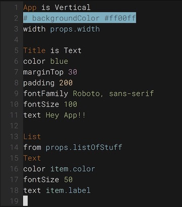

# views-syntax.vim

[Views](https://viewsdx.com) language syntax highlighter for VIM.



```
App is Vertical
# backgroundColor #ff00ff
width props.width

Title is Text
color blue
marginTop 30
padding 200
fontFamily Roboto, sans-serif
fontSize 100
text Hey App!!

List
from props.listOfStuff
Text
color item.color
fontSize 50
text item.label
```

## How to install it?

With [Plug](https://github.com/junegunn/vim-plug)'s plugin manager, add `plug 'viewsdx/syntax-vim'`
and run `:PlugInstall`.

License MIT

Say hi@viewsdx.com :)
